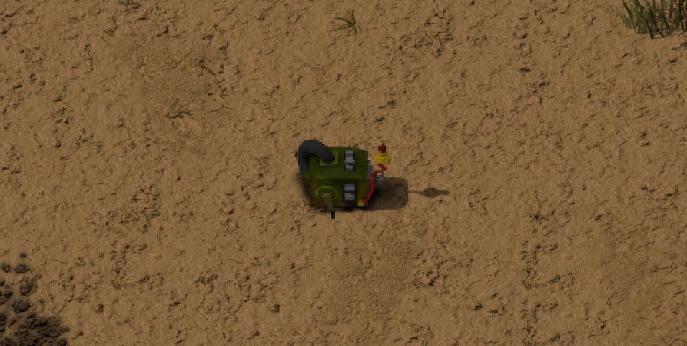

	 
	
	 

# Hand Crank (Factorio Mod)

This is a mod for a hand crank component for the game [Factorio](https://factorio.com).

## Usage

Install the mod via the mod portal (called simply `Hand Crank`).

First, craft/place the hand crank somewhere within an electrical network. Then, to use the crank, run up and into its front face. Continue running to power it.

The crank will give out a steady 10kW of power (I know, that's *insanely* high for a hand crank in real life, but would otherwise be useless in the game).

## Building

To build this mod from scratch, you'll need the following pre-requisites:

- [Blender](https://www.blender.org/)
- [ImageMagick](https://www.imagemagick.org/script/index.php) `convert` (find it in your system's package manager)
- GNU `zip`
- [`luacheck`](https://github.com/mpeterv/luacheck)

If you're not on MacOS or you have Blender installed to another location, you'll need to modify the Makefile
and change the `BLENDER` variable to point to the `blender` executable.

All other utilities are assumed to be on your `PATH`.

To build simply run `make`. The resulting mod will land at `dist/HandCrank_x.y.z.zip` (where `x.y.z` is the current version number).

If you're on MacOS, you can easily install the resulting mod by running `make install`.

Cleaning with `make clean` will **not** remove the Blender renders (though it will remove the composite sprite sheets). This is
the default since rendering is intensive and hefty and I'm prone to write `make clean` way too much.

To _actually_ clean all files (including the render output), run `make clean-all`.

All asset files needed are included in the repository (which is fine becuase there are only a couple).

## License
Copyright &copy; 2018 by Josh Junon. Licensed under the MIT license.
